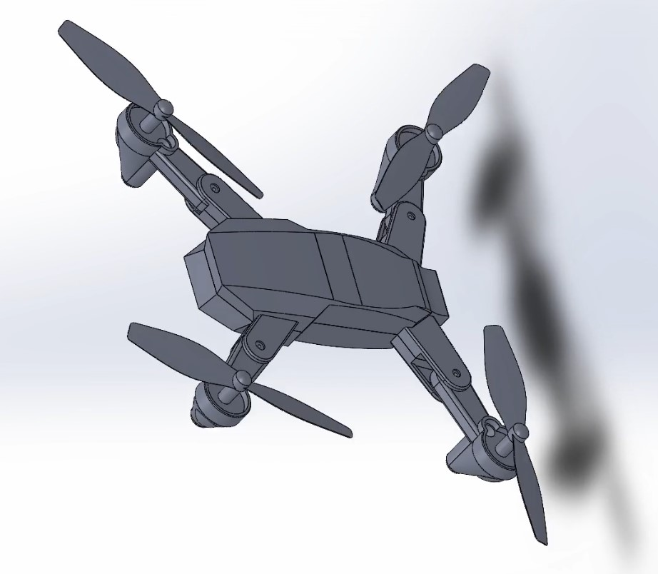
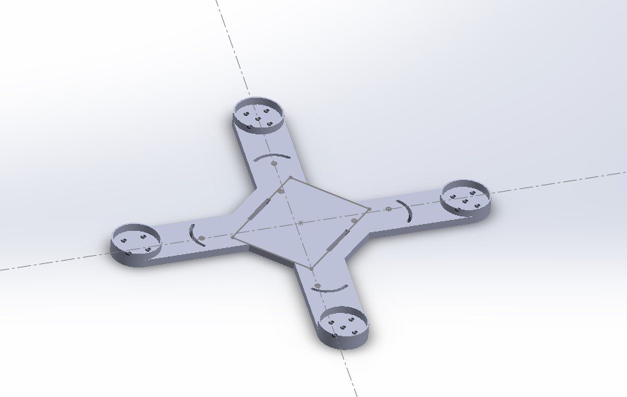
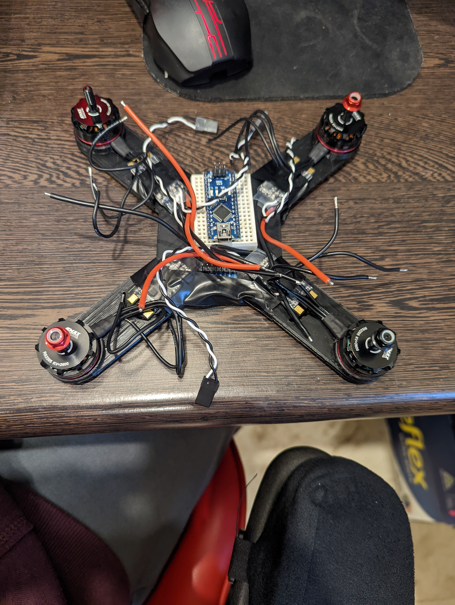
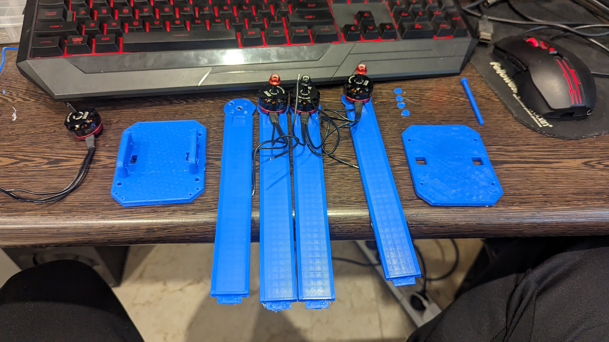

# Quadcopter

## Goal:

The goal of this project is to make a quadcopter, using a microcontroller. The micro-controller that was utilised is an arduino nano. The goal was to make my own flight controller using a gyroscope and accelerometer, the MPU-6050 to be exact. 

## What I learnt:

This project taught me to read data sheets and convert a data sheet into code, I learnt and understood the communication method of I2C and the relationship between master and slave communication. After researching, reading and watching alot of content, I opted to using the MPU-6050 library, in order to save time and uneccessary energy, as long as I understood the fundamentals of reading a data sheet.

## Blog:

[Link to Quadcopter Blog](../Blogs/QuadScript.html)

## Code:

Still in Progress.

[Link to Code](https://github.com/joey101/quadcopter/tree/main/code)

## Picture Gallery: 

### Unmanufacturable Design:

### Old Design:

### New Design:

[back](../index.html)