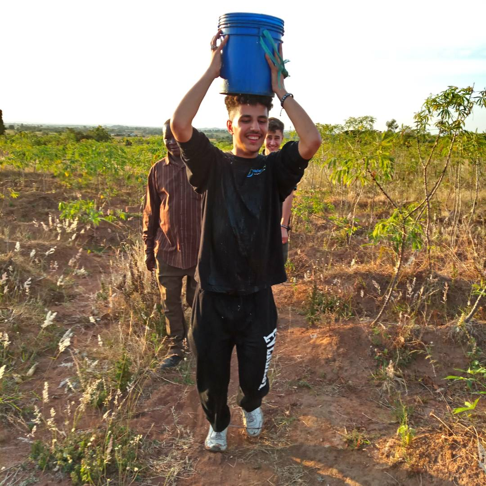

# Welfare Aid International

## Goal:

This project was done in 11th grade as part of a community service. This was part of the IB (International baccalaureate) which was meant to get us out of the study room and into the community.

## What we did:

We travelled to Tanzania in Africa, where we particpated in humantirian projects vised over projects, and attended to schools in need of aid.

## Pictures:

[back](../index.html)